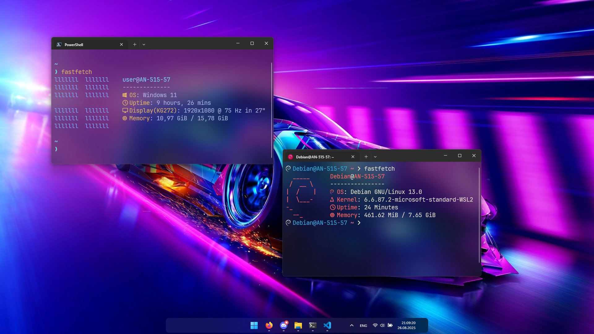

  <h1>
    🪟 Timurkaaa123's windots 🪟
  </h1>

---
# About

- **OS:** [**`Windows 11`**](https://support.microsoft.com/windows) + [**`WSL2`**](https://learn.microsoft.com/en-us/windows/wsl/)
- **Subsystem:** [**`Debian GNU/Linux`**](https://www.debian.org/)
- **Terminal:** [**`Windows Terminal`**](https://github.com/microsoft/terminal)
- **Shell:** [**`Powershell`**](https://learn.microsoft.com/powershell/)
- **Theme:** [**`Tokyo Night`**](https://www.deviantart.com/niivu/art/Tokyo-Night-for-Windows-11-970381220)
- **Icons:** [**`Lumicons`**](https://www.deviantart.com/vantler/art/Lumicons-662277185)
- **Mods:** [**`Windhawk`**](https://windhawk.net/)
- **App Launcher:** [**`PowerToys Run`**](https://learn.microsoft.com/windows/powertoys/run)
- **Browser:** [**`Firefox`**](https://www.firefox.com/)
- **Editor:** [**`VS Code`**](https://code.visualstudio.com/)

 
  
---
# Galery

---
# Features
- Beautiful acrylic blur
- Miniature taskbar
- Convenient keyboard shortcuts
- Starship config
- Beautiful fastfetch config
- Windhawk mods configs
- Beautiful browser
- Using Debian as a subsystem
---
# Installation
Installation instructions are available in the files: [EN](docs/en-guide.md), [RU](docs/ru-guide.md).

---
# HotKeys
- Open terminal - `win + enter`
- Open Tiscord - `win + shift + D`
- Open Delegram - `win + shift + T`
- Color Picker - `win + shift + C`
- Fancy Zones activate - `shift`
- Fancy Zones editor - `win + shift + ~`
- PowerToys Run - `alt + space`
- Workspaces - `win + ctrl + ~`
